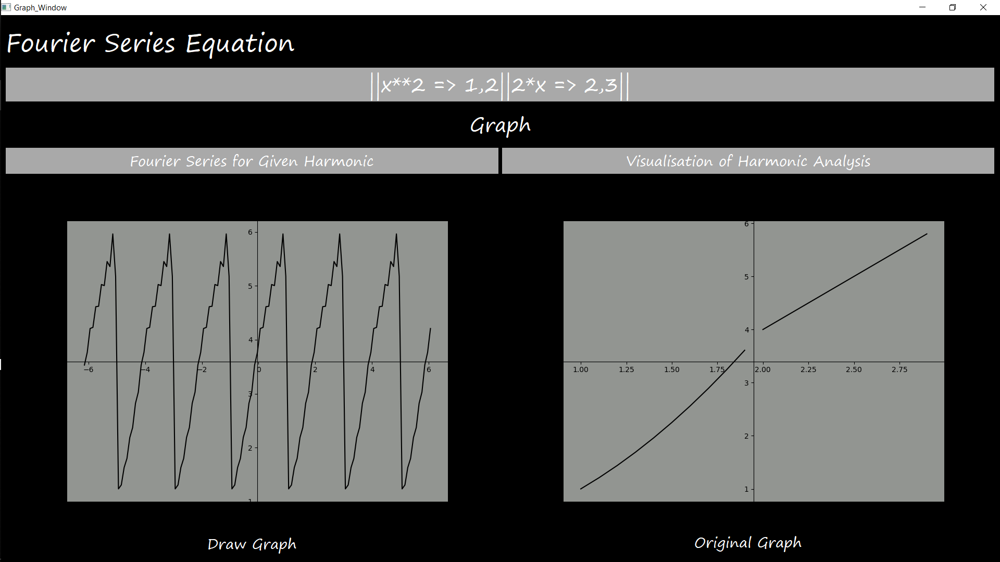

# Python-harmonic-analysis
Harmonic Analysis of Fourier Series with PyQt5 
  
##Required Packages

* PyQt5
* Sympy
* Numpy
* Pyqtgraph
* Matplotlib

###Installation

```bash
python3 setup.py
``` 

###Usage
Make sure you have installed all the packages with setup.py

```bash
python internal/Ui_Start.py
```


###Screenshots

###Start Screen

###Input Screen

###Add multiple functions

###Graphical visualization


## Contributing
Pull requests are welcome. For major changes, please open an issue first to discuss what you would like to change.

Please make sure to update tests as appropriate.

## License
[MIT](https://choosealicense.com/licenses/mit/)
