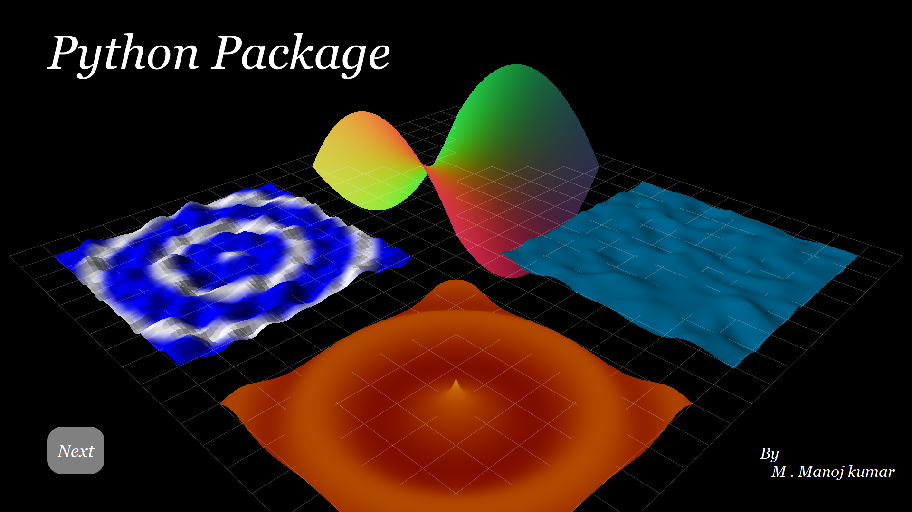

# Python-harmonic-analysis
Harmonic Analysis of Fourier Series with PyQt5 

# <h2>Required Packages

* PyQt5
* Sympy
* Numpy
* Pyqtgraph
* Matplotlib

<h5>To install the packages run setup.py and to start the application run the PythonPackage.py file 
 

<h2> Screenshots </h2>

 
 
 
 

